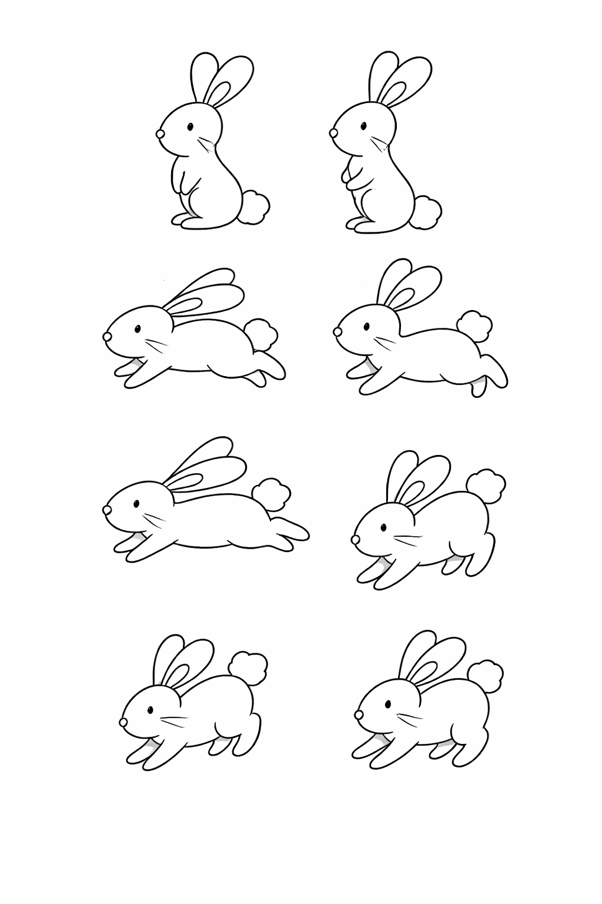

# 🐰 Crear 8 poses de un conejo en Blender

## 🎯 Objetivo
Aprender a crear un conejo en Blender y generar 8 poses para simular movimiento.

---

## 🧰 Requisitos
- Tener instalado Blender
- Conocimientos básicos de mover, rotar y escalar objetos

---

## 🐰 Paso 1: Crear el conejo

1. Abrir Blender
2. Eliminar el cubo inicial (X → Delete)
3. Agregar una esfera:
   - Shift + A → Mesh → UV Sphere
4. Escalar para hacer el cuerpo (S)
5. Agregar orejas:
   - Shift + A → Mesh → Cylinder
   - Escalar y alargar (S, Z)
6. Duplicar oreja:
   - Shift + D

---

## 🎨 Paso 2: Aplicar colores

1. Seleccionar el conejo
2. Ir a Material Properties
3. Asignar colores:

- Cuerpo → #B8B8B8
- Orejas (interior) → #F4A6B8
- Ojos → #1A1A1A
- Nariz → #4D4D4D

---

## 🦴 Paso 3: Preparar para poses

1. Seleccionar el conejo
2. Entrar en Object Mode
3. Usar:
   - R → Rotar
   - G → Mover
   - S → Escalar

---

## 🐾 Paso 4: Crear las 8 poses

### 🐰 Pose 1 – Reposo
Conejo sentado normal.

### 🐰 Pose 2 – Preparación
Inclinar cuerpo hacia adelante.

### 🐰 Pose 3 – Impulso
Doblar patas traseras.

### 🐰 Pose 4 – Salto
Levantar todo el cuerpo.

### 🐰 Pose 5 – Vuelo
Cuerpo estirado.

### 🐰 Pose 6 – Caída
Inclinar hacia abajo.

### 🐰 Pose 7 – Aterrizaje
Patas delanteras abajo.

### 🐰 Pose 8 – Recuperación
Volver a posición inicial.

---

## 📸 Paso 5: Guardar poses

1. Mover el conejo
2. Renderizar (F12)
3. Guardar imagen:
   - Image → Save As

Repetir para cada pose.

---

## 🖼️ Imagen de referencia

## 🎬 Animación del conejo

---

## 🧠 Conclusión
Este ejercicio ayuda a entender animación básica en Blender usando poses.
